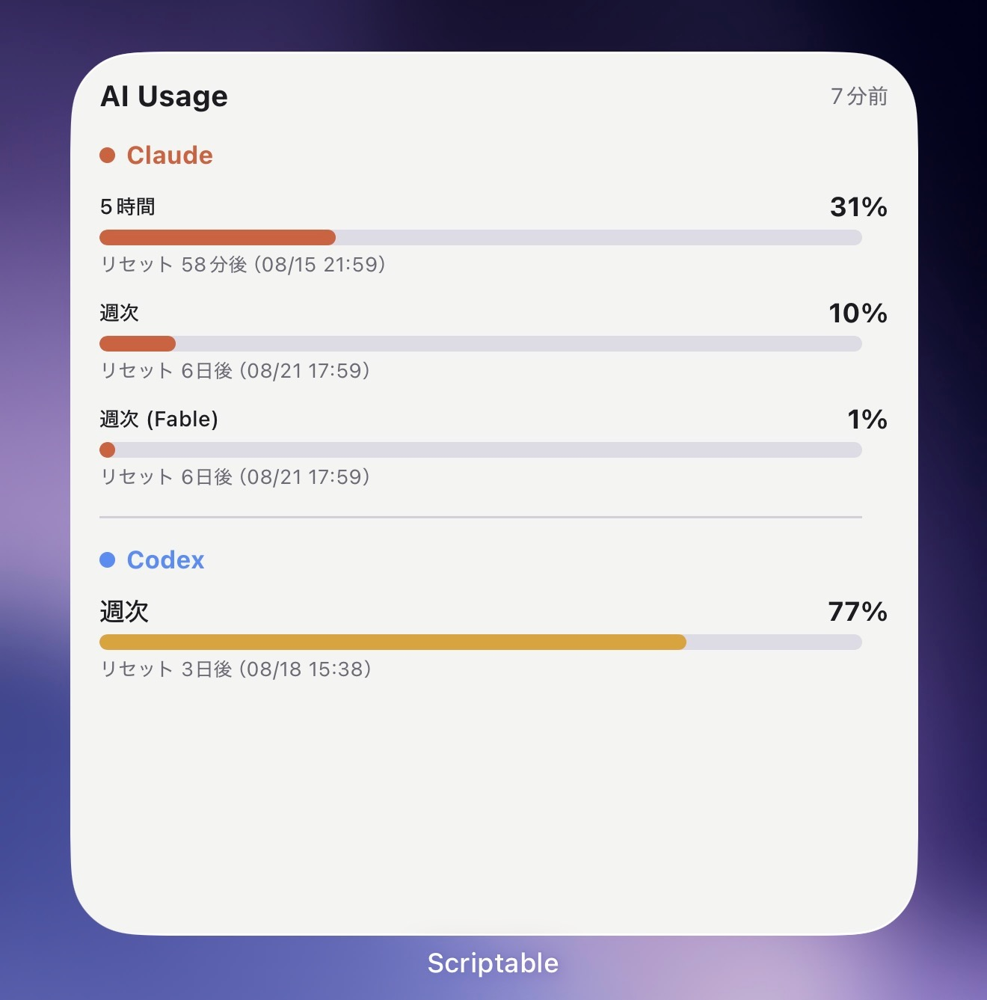
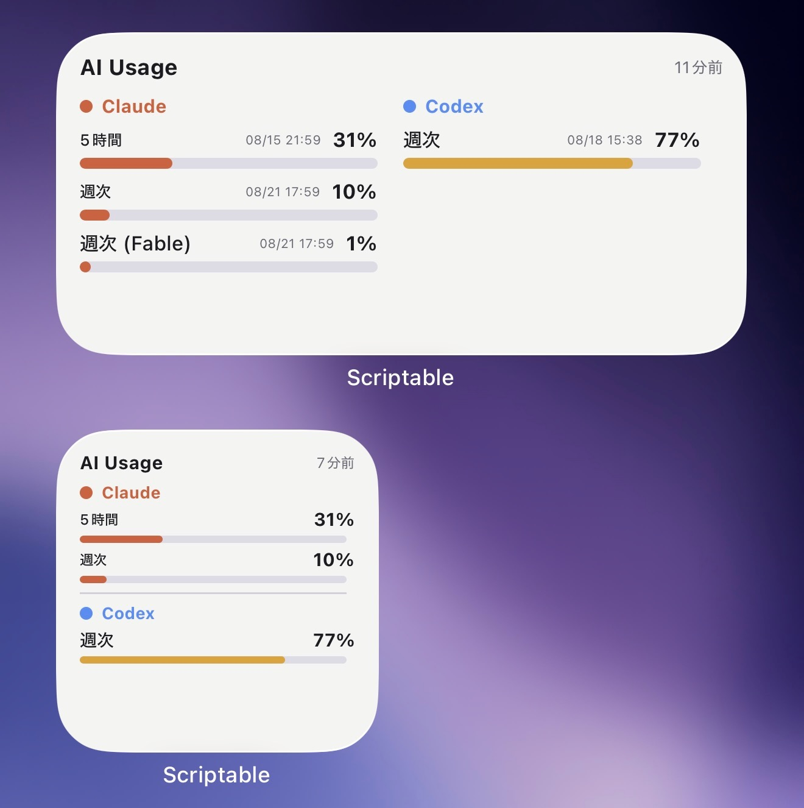

[English](README.en.md) | **日本語**

# AI Usage Widget

Claude と Codex のサブスク使用枠を、iPhone のホーム画面に表示するツールです。
Mac 側のスクリプトが 30 分ごとに使用率を取得して JSON ファイルに書き出し、
iOS の [Scriptable](https://scriptable.app/) ウィジェットがそれを読んで描画します。

ウィジェットの表示言語は端末の設定に従います（日本語端末では日本語、それ以外は英語）。

> ### ⚠️ 使う前に必ずお読みください
>
> **このツールは非公開エンドポイントを 2 つ使っています。**
>
> | | エンドポイント |
> |---|---|
> | Claude | `api.anthropic.com/api/oauth/usage` |
> | Codex | `chatgpt.com/backend-api/codex/usage` |
>
> いずれも公式に文書化されたものではなく、**予告なく変更されて動作しなくなります。**
> 各サービスの利用規約はご自身で確認してください。
>
> **ローカルの認証情報を読み取ります**（macOS keychain の `Claude Code-credentials` と
> `~/.codex/auth.json`）。**読み取るだけで、Mac の外へは送信しません。**書き出す JSON に
> 含まれるのは使用率・リセット時刻・状態のみです。それでも認証情報を扱うスクリプト
> ですので、**実行前に `ai_usage_fetch.py` をご自身で確認してください。**800 行ほどです。
>
> 個人が自分用に作成したものであり、**動作は保証できません。**
> 詳細は [READ_FIRST.md](READ_FIRST.md) をご覧ください。

## 表示例

<p align="center">
  <picture>
    <source media="(prefers-color-scheme: dark)" srcset="docs/images/widget-large-dark.jpg">
    
  </picture>
  <picture>
    <source media="(prefers-color-scheme: dark)" srcset="docs/images/widget-medium-small-dark.jpg">
    
  </picture>
</p>

左が large。右は medium（上・2 列）と small（下）です。
サイズごとの違いは[ウィジェットのレイアウト](#ウィジェットのレイアウト)にまとめています。
画像は端末のテーマに合わせて light / dark が切り替わります。

## 動作環境

**収集側は macOS 専用、表示側は iOS 専用です。**Windows / Linux では動作しません
（[後述](#windows--linux-について)）。

| | 必要なもの |
|---|---|
| 収集 | **macOS**（常時起動・スリープしない設定を推奨）、Python 3 |
| | Claude Code CLI と `codex` CLI（**強く推奨。**トークン失効時の自動復旧に使います） |
| 表示 | **iPhone / iPad**、[Scriptable](https://scriptable.app/) |
| 受け渡し | 共有リンクを作成できる場所（Dropbox / Google ドライブ / OneDrive / 自前の HTTP サーバー） |

> ### ⚠️ 読み取るのは CLI の認証情報です
>
> **デスクトップアプリだけを使っていると、いずれ使用枠を取得できなくなります。**
>
> アプリと CLI では認証情報の保管場所が別で、このツールが読むのは CLI 側です。
> アプリをどれだけ使っても、下記のファイルは更新されません。
>
> | | このツールが読む場所 | 更新できるもの |
> |---|---|---|
> | Claude | keychain の `Claude Code-credentials` | **Claude Code CLI のみ** |
> | Codex | `~/.codex/auth.json` | **`codex` CLI のみ** |
>
> いずれも実測です。Claude はアプリを起動したまま 27 時間・53 回連続で
> `login_required`、Codex はアプリ常時起動のまま 183 時間失効し続けました。
> **アプリのスケジュール実行（ルーティン）でも更新されません。**
>
> **CLI を入れておけば自動で復旧します。**失効を検知したときだけ 1 回呼び出します
> （Claude は `claude -p`、Codex は `codex exec`。どちらも最大 1 時間に 1 回、
> ターンを 1 回消費します）。入れない場合は、失効のたびに手動でのログインが必要です。
>
> トークンの寿命は **Claude が約 8 時間、Codex が約 10 日**です。Codex は長いぶん、
> 切れても気づきにくく、古い値を何日も表示し続けることがあります。

**動作を確認したプランは Claude Max と Codex team のみです。**他のプランでは未検証で、
`limits[]` の構成や Codex の `secondary_window` が異なる可能性があります。

## 仕組み

```
Mac（常時起動）
├─ ai_usage_fetch.py … Claude は OAuth エンドポイント、Codex は内部 API から取得
│                      （失敗した場合のみ ~/.codex のログを読む）
├─ launchd が 30 分ごとに実行
└─ 出力先: 共有フォルダ、iCloud Drive/Scriptable/ai-usage.json
iPhone
└─ AIUsage.js（Scriptable ウィジェット）が取得して描画
```

ウィジェットは次の 3 つを順に試し、`generated_at`（データを生成した時刻）が最も新しい
ものを採用します。

1. **共有リンク（HTTPS）** — 外出先でもモバイル回線でも取得できます
2. **iCloud 上のファイル**
3. **端末内に保存した控え** — 1 と 2 のいずれからも取得できなかった場合に使用します

共有リンクを最優先にしているのは、**iOS のウィジェットからは、iCloud 上にあるだけで
端末にダウンロードされていないファイルを読み込めない**ためです。iCloud だけに頼ると、
端末にファイルが届くまで表示が更新されません。

## セットアップ

### 1. Mac

```bash
AI_USAGE_PUBLIC_PATH="$HOME/Dropbox/ai-usage/ai-usage.json" ./install.sh
```

30 分ごとに実行される launchd ジョブ（`local.ai-usage`）を登録します。リポジトリ内の
`ai_usage_fetch.py` を直接呼び出すため、ファイルは複製されません。`~/.ai-usage/` は
キャッシュとログの保存先です。登録を解除する場合は `./install.sh uninstall` を実行します。

`AI_USAGE_PUBLIC_PATH` には、クラウドに同期されるフォルダ内のパスを指定します。
インストール時に指定した値は launchd の設定に埋め込まれ、同時に
`~/.ai-usage/public_path` にも保存されます。そのため、後から
`python3 ai_usage_fetch.py` を手動で実行した場合も同じファイルに書き出されます。

指定しなかった場合の出力先は、リポジトリ内の `public/ai-usage.json` です。この状態で
手動実行のときだけ `AI_USAGE_PUBLIC_PATH` を付けると、launchd と手動実行で出力先が
分かれ、共有リンクが古いファイルを指したままになります。**出力先を変更するときは、
環境変数を付けて `./install.sh` を実行し直してください。**

### 2. 共有リンク

書き出された `ai-usage.json` に、**「リンクを知っている全員」**が閲覧できる共有リンクを
作成します。リンクは各サービスが発行した形式のまま登録できます。ダウンロード用 URL への
変換はウィジェット側で行います。

| サービス | 発行されるリンク | ウィジェットによる変換 |
|---|---|---|
| Dropbox | `.../ai-usage.json?rlkey=…&dl=0` | `dl=1` に書き換え |
| Google ドライブ | `.../file/d/<ID>/view?usp=sharing` | `drive.usercontent.google.com/download?id=<ID>` |
| OneDrive / SharePoint | `https://1drv.ms/...` | `download=1` を付加 |
| 自前の HTTP サーバー | そのまま | なし |
| GitHub raw / Gist raw | そのまま | なし |

表にないサービスでも、JSON がそのまま返る URL であれば利用できます。ログインを要する
リンクからは取得できません。JSON 以外が返る URL を登録した場合は、iCloud、端末内の控えの
順に切り替わります。

> **共有リンクは、URL を知っていれば誰でも閲覧できます。**内容は使用率・リセット時刻・
> 状態のみで認証情報は含まれませんが、その範囲の情報は公開されることになります。

### 3. iPhone

`AIUsage.js` を iCloud Drive の `Scriptable/` フォルダに配置し、ホーム画面に Scriptable
ウィジェットを追加して、Script に `AIUsage` を選択します。

続いて **Scriptable アプリ内で** `AIUsage` を 1 回実行します。共有リンクの入力欄が
表示され、保存すると**その場で 1 回取得し、成否を通知します**。入力したリンクは
Scriptable の Keychain（`ai-usage-url`）に保存され、スクリプトファイルには
書き込まれません。

> **リンクを `AIUsage.js` に直接書き込まないでください。**このファイルは他者に渡ることが
> あるため、書き込むとリンクも一緒に渡ります。

入力欄が表示されるのは、リンクが未登録の場合と、登録済みのリンクから取得できなかった
場合のみです。正常に動作している状態でアプリ内から実行した場合は、プレビューを表示する
だけです。

登録済みのリンクを変更するには、ショートカットアプリの `Run Script` でパラメータに
`setup` を渡して `AIUsage` を実行します。現在のリンクが入力された状態で入力欄が表示され、
空欄で保存すると登録が削除されて iCloud 経由の取得に戻ります。

## ウィジェットのレイアウト

Claude と Codex はサービスごとにグループ分けし、見出し・区切り線・サービスの色
（Claude はオレンジ、Codex は青）で区別します。使用量のバーは通常サービスの色で表示し、
50% 以上で琥珀色、80% 以上で赤色に変わります。

レイアウトはウィジェットのサイズによって変わります。small と medium は高さが 158pt しか
ないため、small はリセット日時を省いてバーだけを並べ、medium は横幅を使って 2 列にします。

| サイズ | レイアウト | 表示内容 |
|---|---|---|
| small | 1 列 | Claude の 2 枠と Codex の 2 枠（`weekly_scoped` は週次枠の内訳のため省略。リセット日時なし） |
| medium | **2 列**（Claude ｜ Codex） | すべての枠、リセット日時（`MM/DD HH:MM` を行内に簡略表示） |
| large | 1 列 | すべての枠、リセットまでの時間と日時（`3日後（08/20 13:02）`）、クレジット |

クレジットの行が出るのは、追加クレジットの情報を取得できたときだけです
（上の表示例には写っていません）。

実際の表示は[表示例](#表示例)にあります。

## うまくいかないとき

```bash
python3 ai_usage_fetch.py --raw      # 加工前のレスポンスをそのまま表示
python3 ai_usage_fetch.py --stdout   # ファイルに書き出さず、結果の JSON のみ表示
tail -n 20 ~/.ai-usage/fetch.log     # launchd での実行結果を確認
```

> **`--raw` の出力には、Codex 側の `email` / `user_id` / `account_id` が含まれます。**
> issue や SNS に貼り付ける際は必ず削除してください。

ログには 1 行ごとに実行結果が記録されます。

```
2026-08-01T21:07:32+09:00 claude=ok codex=ok [token_exp=... icloud=changed dropbox=ok] -> ...
```

- `claude=login_required` — keychain のトークンが失効しています。これを更新できるのは
  **Claude Code の CLI のみ**で、デスクトップアプリやそのスケジュール実行では更新
  されません。そのため、失効を検知したときだけ `claude -p` を 1 回（最大で 1 時間に
  1 回）実行し、公式のツールに更新させています
- `codex=login_required` — `~/.codex/auth.json` を確認してください。API と JSONL の
  **両方**が読めないときだけ出ます
- `codex_api=...` が付いている — **API が失敗し、JSONL の古い値を配っています。**
  `codex` 自体は `ok` のままなので、この項目が唯一の手がかりです。`codex_age=183h`
  のように、配っている値が何時間前のものかも出ます

  ```
  claude=ok codex=ok [codex_api=login_required codex_age=183h ...]
  ```

  **JSONL は Codex で実際にターンを回さないと増えません。**アプリを起動している
  だけでは 1 件も増えないので、放置すると同じ値を何日も配り続けます。復旧は
  API 側を直す（＝再ログインする）以外にありません
- `codex_exp=...` — Codex のトークンの失効予定です。**約 10 日**と長く、更新するのは
  `codex` CLI だけです。**デスクトップアプリでは更新されません**（アプリを起動した
  ままでも切れます）
- `codex_cli_refresh` — 失効を検知したので `codex exec` を 1 回実行し、公式ツールに
  `auth.json` を更新させました（最大で 1 時間に 1 回）。Claude 側の `cli_refresh` と
  同じ仕組みです。**これが出ているのに `codex_api=login_required` が続く場合は、
  自動では戻せない状態**なので、ターミナルで `codex login` を実行してください
- `claude=empty` / `codex=empty` — 通信には成功したものの、枠を 1 件も読み取れていません。
  レスポンスのキー名が変更された可能性が高いため、`--raw` で実際の内容を確認してください
- `icloud=skipped` — 前回から内容が変わらなかったため、iCloud 上のファイルを更新して
  いません。意図した動作です。30 分ごとに書き換えると、端末側の同期が追いつかなくなります

## バージョン

`0.14.0` です。変更履歴は [CHANGELOG.md](CHANGELOG.md) にあります。

作者の環境では安定して動作していますが、**作者以外の環境での導入例がまだありません。**
開発中には、シェルのロケールが異なるだけで `install.sh` が失敗する不具合が見つかりました
（`LANG=C` では成功し、`ja_JP.UTF-8` では失敗するというものです）。このように環境差でしか
表面化しない問題が残っている可能性があります。**別の環境で動作を確認できた時点で
1.0.0 にします。**

不具合を報告いただく際は、`python3 ai_usage_fetch.py --version` の出力、または書き出された
JSON の `app_version` を添えてください。

## Windows / Linux について

現時点では動作しません。対応していないのは次の 3 点です。

1. **Claude の認証情報の読み取り** — `security` コマンド（macOS keychain）を使用しています。
   Windows / Linux の Claude Code は `~/.claude/.credentials.json` に保存するはずで、
   **コードはすでにそちらも参照します**。そのまま動作する可能性はありますが、未検証です
2. **定期実行** — launchd を使用しています。Windows ではタスク スケジューラ、Linux では
   systemd または cron に置き換える必要があります
3. **iCloud への書き出し** — macOS 以外にはそのパスが存在しないため、出力先の存在を
   確認する処理が必要です

Codex 側（`~/.codex/auth.json` と rollout JSONL）は OS に依存しません。また
**`AIUsage.js` は HTTPS で JSON を取得するだけ**ですので、iPhone 側は収集側の OS を
問いません。

対応の Pull Request や動作報告は歓迎します。ただし作者は Windows / Linux で検証できない
ため、実機で確認できる方のご協力が必要です。

## もっと詳しく

- [docs/internals.md](docs/internals.md) — 実際に確認したレスポンスのキー名、出力
  フォーマット、ウィジェットの実装上の判断、iCloud まわりの注意点。
  **動作しなくなったときは、まずこちらをご覧ください**
- [CLAUDE.md](CLAUDE.md) — 何を試して不採用にしたか、何を再検討しないと決めたかの記録
- [READ_FIRST.md](READ_FIRST.md) — 利用前の注意事項（このページ冒頭の詳細版）

## ライセンス

MIT ライセンスです。詳細は [LICENSE](LICENSE) をご覧ください。
